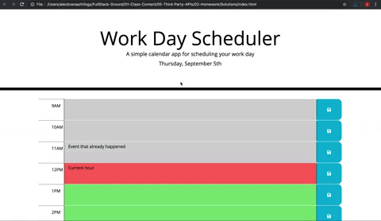

# Third-Party APIs: Work Day Scheduler

## Description

Create a simple calendar application that allows a user to save events for each hour of the day by modifying starter code. This app will run in the browser and feature dynamically updated HTML and CSS powered by jQuery.

You'll need to use the [Moment.js](https://momentjs.com/) library to work with date and time. Be sure to read the documentation carefully and concentrate on using Moment.js in the browser.

## User Story

AS AN employee with a busy schedule
I WANT to add important events to a daily planner
SO THAT I can manage my time effectively

## Acceptance Criteria

GIVEN I am using a daily planner to create a schedule
WHEN I open the planner
THEN the current day is displayed at the top of the calendar
WHEN I scroll down
THEN I am presented with timeblocks for standard business hours
WHEN I view the timeblocks for that day
THEN each timeblock is color coded to indicate whether it is in the past, present, or future
WHEN I click into a timeblock
THEN I can enter an event
WHEN I click the save button for that timeblock
THEN the text for that event is saved in local storage
WHEN I refresh the page
THEN the saved events persist

## Usage

Once deployed the application can be viewed in a traditional desktop web browser. This is a simple calendar application that allows a user to save events for each hour of the day. This app will run in the browser and feature dynamically updated HTML and CSS powered by jQuery.

You'll need to use the [Moment.js](https://momentjs.com/) library to work with date and time. Be sure to read the documentation carefully and concentrate on using Moment.js in the browser.

## Credits

Collaborators on this project included instructional staff, TAs, and students from University of Central Florida.
A special thanks to my daughter, Yennefer. Small but mighty!

## References and tutorials utilized

* Javascript: [w3 Schools](https://www.w3schools.com/js/js_intro.asp/)
* Markdown: [Markdown Guide](https://www.markdownguide.org/basic-syntax/)
* CSS: [W3 Schools](https://www.w3schools.com/cssref/)
* Reset: [Eric Meyer](https://meyerweb.com/eric/tools/css/reset/)
* Jquery: [W3 Schools](https://www.w3schools.com/jquery/default.asp/)
* Bootstrap: [W3 Schools](https://www.w3schools.com/bootstrap/default.asp/)

## Links

* Deployed site: [Live site-404pandas](linkToLiveSiteHere)
* Github repo: [Github-404pandas](linkToRepoHere)
  
## Screenshots

  
  
  
  
## License

MIT License

Copyright (c) [2022] [Mary Elenius]

Permission is hereby granted, free of charge, to any person obtaining a copy
of this software and associated documentation files (the "Software"), to deal
in the Software without restriction, including without limitation the rights
to use, copy, modify, merge, publish, distribute, sublicense, and/or sell
copies of the Software, and to permit persons to whom the Software is
furnished to do so, subject to the following conditions:

The above copyright notice and this permission notice shall be included in all
copies or substantial portions of the Software.

THE SOFTWARE IS PROVIDED "AS IS", WITHOUT WARRANTY OF ANY KIND, EXPRESS OR
IMPLIED, INCLUDING BUT NOT LIMITED TO THE WARRANTIES OF MERCHANTABILITY,
FITNESS FOR A PARTICULAR PURPOSE AND NONINFRINGEMENT. IN NO EVENT SHALL THE
AUTHORS OR COPYRIGHT HOLDERS BE LIABLE FOR ANY CLAIM, DAMAGES OR OTHER
LIABILITY, WHETHER IN AN ACTION OF CONTRACT, TORT OR OTHERWISE, ARISING FROM,
OUT OF OR IN CONNECTION WITH THE SOFTWARE OR THE USE OR OTHER DEALINGS IN THE
SOFTWARE.